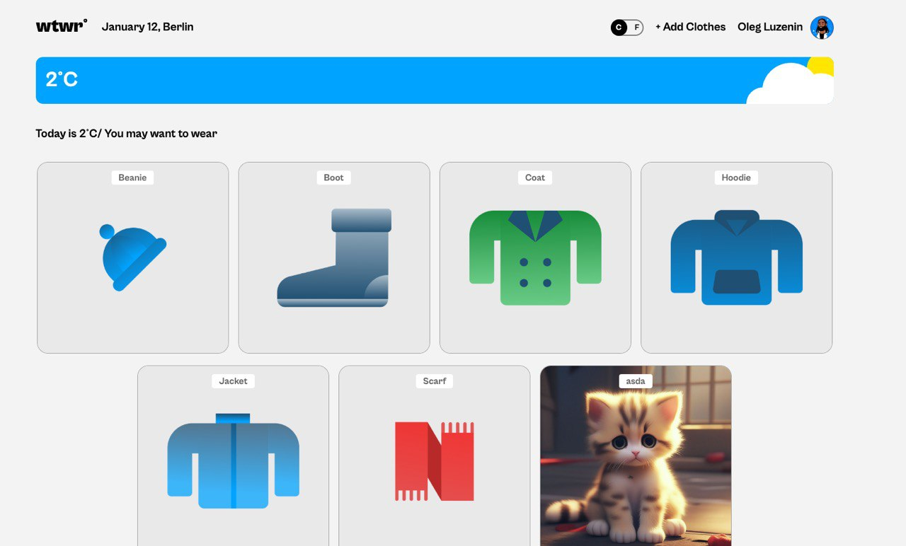
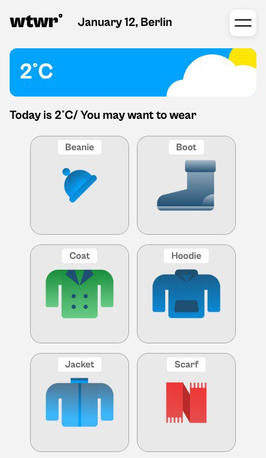

# 🌤️ What to Wear (WTWR) — React Front-End Application

**What to Wear** is a React-based front-end application designed to help users choose appropriate clothing based on current weather conditions. 🧥👕 It fetches weather data from the OpenWeather API and provides personalized recommendations for your wardrobe.

## Important! The GitHub pages deployment and live version will NOT work for now, because the project uses JSON server and makes API calls to JSON server.

---

## Screenshots

### Homepage



### Responsive Design



## ✨ Features

- 🔑 **User Authentication:** Users can register and log in to get personalized recommendations.
- 📝 **Profile Editing:** Update profile information such as name and avatar.
- 🛍️ **Manage Wardrobe:** Add or remove clothing items from your collection.
- ❤️ **Like Your Clothes:** Like or unlike clothing items in your wardrobe.
- 🌦️ **Weather-Based Recommendations:** Get wardrobe suggestions tailored to current weather conditions.

---

## 💻 Technologies and Tools

- ⚛️ **React**: A library for building user interfaces.
- ⚡ **Vite**: A fast development tool for React applications.
- 🌐 **OpenWeather API**: Fetch real-time weather data.
- 🚀 **JavaScript (ES6+)**: The primary language for building the app.
- 🎨 **CSS**: For styling the user interface.
- 📚 **BEM**: Methodology for naming CSS classes for maintainable code.
- 🖌️ **Figma**: For UI/UX design and prototyping.
- 🛠️ **Git and GitHub**: For version control and code hosting.
- 🛡️ **ESLint and Prettier**: For code quality and consistency.
- 🛎️ **React Context**: For state management across components.
- 🧭 **React Router**: For client-side routing.
- 📡 **Axios**: For making HTTP requests to the API.

---

## 🚀 Getting Started

Follow these steps to set up the project locally:

1. **Clone the repository**:

   ```bash
   git clone git@github.com:oleg-lzn/se_project_react.git
   ```

2. **Navigate to the project directory**:

   ```bash
   cd se_project_react
   ```

3. **Dependencies**:

The following dependencies are required for this project. They will be installed automatically when you run `npm install`.

### Main Dependencies

- **React**: ^18.0.0 — A library for building user interfaces.
- **React DOM**: ^18.0.0 — The React package for working with the DOM.
- **Axios**: ^1.0.0 — For making HTTP requests.
- **React Router DOM**: ^6.0.0 — For managing routing in the app.
- **OpenWeather API** — Provides weather data for the app.

### Development Dependencies

- **Vite**: ^4.0.0 — A fast development tool for React projects.
- **ESLint**: ^8.0.0 — Ensures code quality and consistency.
- **Prettier**: ^3.0.0 — Code formatting.

These dependencies are defined in the `package.json` file.

4. **Start the development server**:

   ```bash
   sudo npm install -g json-server@^0
   json-server --watch db.json --id _id --port 3001
   npm run dev
   ```

   The app will be available at `http://localhost:3000` 🎉.

---

## 👨‍💻 Author

- **Oleg Luzenin** — [GitHub Profile](https://github.com/oleg-lzn)

---

## 📝 About This Project

This project demonstrates the integration of a React front-end with an Express backend. It showcases features like user authentication, state management, API integration, and responsive UI design. 🌟

---
